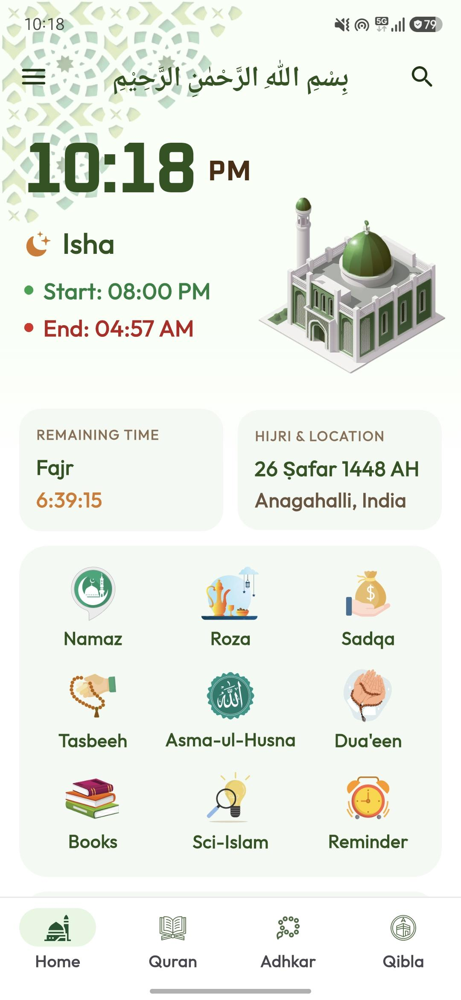
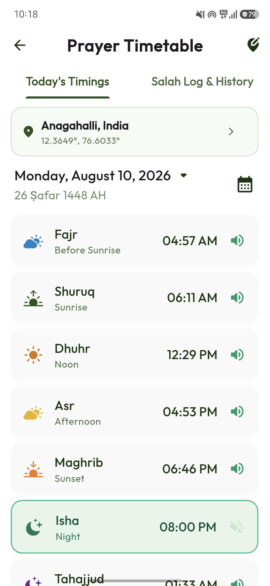
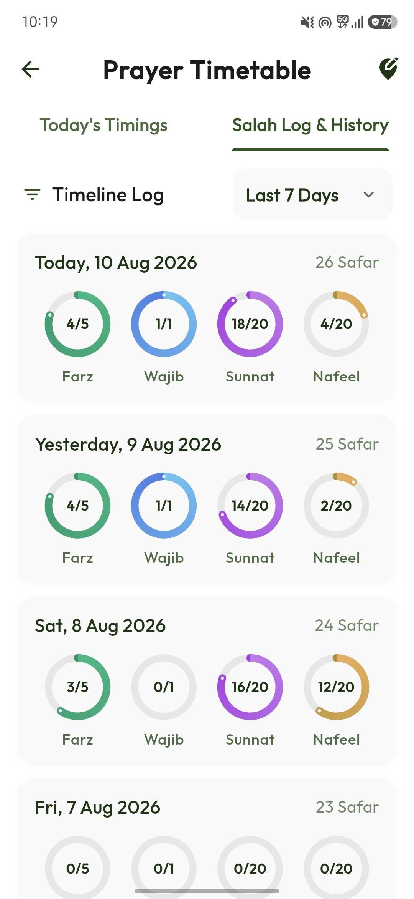
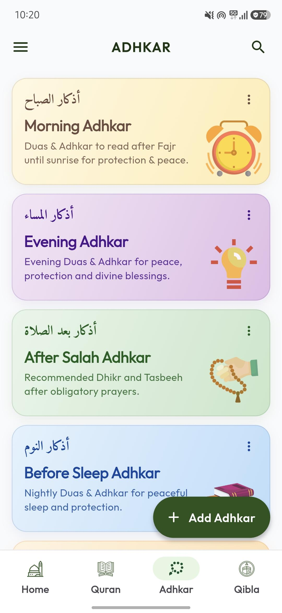
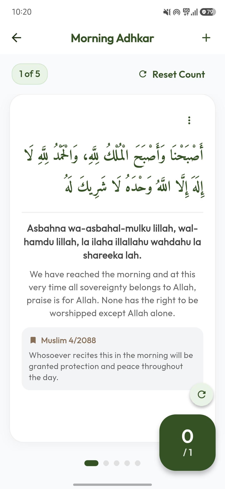
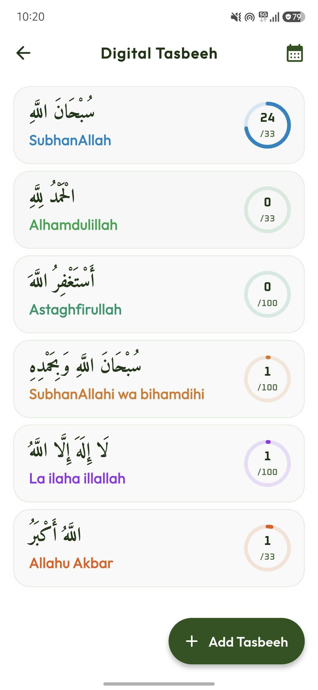
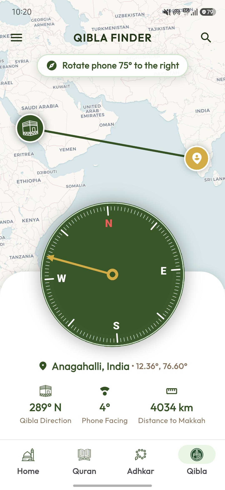
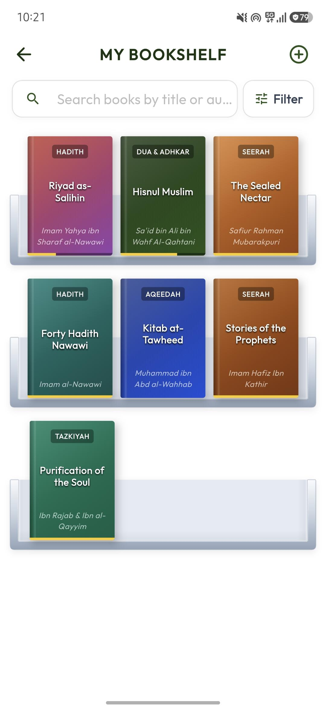
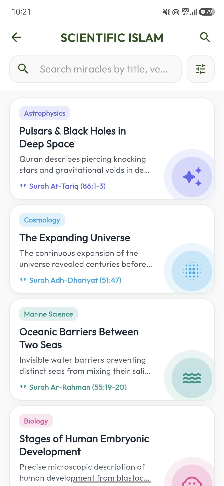
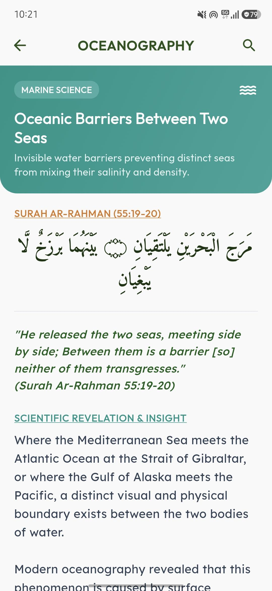

# 🕌 Adhkar - Your Daily Spiritual Islamic Companion

<p align="center">
  
</p>

<h3 align="center">A free, privacy-first, and feature-rich Islamic companion application built with Flutter & Dart.</h3>

<p align="center">
  <a href="https://flutter.dev"></a>
  <a href="https://dart.dev"></a>
  <a href="https://supabase.com"></a>
  <a href="#license"></a>
  <a href="#-contact--support"></a>
</p>

<p align="center">
  <a href="#-download-app">Download App</a> •
  <a href="#-app-screenshots">Screenshots</a> •
  <a href="#-features">Features</a> •
  <a href="#-directory-structure">Directory Structure</a> •
  <a href="#-getting-started">Getting Started</a> •
  <a href="#-contact--support">Contact</a>
</p>

---

## 📲 Download App

Experience a calm, ad-free, and distraction-free Islamic companion on your mobile device.

<p align="center">
  <a href="https://play.google.com/store/apps/details?id=com.kabeer.adhkar">
    
  </a>
  &nbsp;&nbsp;&nbsp;&nbsp;
  <a href="https://apps.apple.com/app/id0000000000">
    
  </a>
</p>

> 💡 *Note: Download links are currently placeholders and will be updated upon official store publication.*

---

## 📱 App Screenshots

Here is a visual preview of the **Adhkar** user experience:

### 🏠 Dashboard & 🕌 Prayer Timings
<p align="center">
  &nbsp;&nbsp;&nbsp;&nbsp;
  &nbsp;&nbsp;&nbsp;&nbsp;
  
</p>

### 📿 Daily Adhkar & 🔢 Digital Tasbeeh
<p align="center">
  &nbsp;&nbsp;&nbsp;&nbsp;
  &nbsp;&nbsp;&nbsp;&nbsp;
  
</p>

### 🕋 Qibla Finder, 📚 Islamic Books & 🧪 Science in Islam
<p align="center">
  &nbsp;&nbsp;
  &nbsp;&nbsp;
  &nbsp;&nbsp;
  
</p>

---

## ✨ Features

- 🕌 **Prayer Timings & Adhan Alerts**: Precise location-based prayer schedules (Fajr, Sunrise, Dhuhr, Asr, Maghrib, Isha) with customizable calculation methods & Madhab settings.
- 📿 **Daily Adhkar Collection**: Morning, Evening, After-Salah, Sleep, and Waking Adhkar with Arabic scripts, transliteration, English translation, and repetition counters.
- 🔢 **Digital Tasbeeh Counter**: Tap-to-count counter with haptic feedback, custom targets, preset dhikr lists, and progress tracking.
- 🕋 **Live Qibla Compass**: Sensor-based and interactive map-guided Qibla direction locator.
- 📖 **Holy Quran**: Surah directory, verses reading mode, translations, and audio recitations.
- 🤲 **Dua Collection**: Comprehensive authentic supplications from the Quran & Sunnah for daily life occasions.
- ✨ **Asma-ul-Husna**: 99 Names of Allah with audio recitations, Arabic text, meanings, and benefits.
- 📚 **Islamic Books & Reader**: Built-in digital library and reader for Islamic literature and reference books.
- 🌙 **Roza / Fasting Tracker**: Suhoor and Iftar countdown timers, Ramadan schedule, and fasting log.
- 💚 **Sadqa / Charity Tracker**: Track Sadaqah contributions, calculate Zakat, and set charity goals.
- 🧪 **Science in Islam**: Explore scientific facts and natural phenomena referenced in Quranic verses.
- 📅 **Hijri Calendar**: Dual Hijri-Gregorian calendar with key Islamic event highlights and regional moon sighting adjustments.
- 🔕 **Quiet Hours (DND)**: Automatic Do Not Disturb mode during congregational prayer times to avoid mobile distractions.
- 🔔 **Smart Reminders**: Customizable daily worship alerts, dhikr reminders, and local push notifications.

---

## 📂 Directory Structure

Below is the complete project directory structure with a concise explanation for each folder:

<details open>
<summary><b>🔍 View Full Project Tree</b></summary>

```text
adhkar/
├── android/                   # Native Android platform configurations and build manifests
├── assets/                    # Static app assets including audios, books, images, and mockups
│   ├── audios/                # Audio recordings for Adhan, Quran, and Dhikr recitations
│   ├── books/                 # Bundled Islamic reading materials and PDF documents
│   └── images/                # Graphics, logos, icons, marble textures, and UI Mockups
│       └── Mockups/           # High-resolution app UI screenshots for showcase
├── ios/                       # Native iOS platform configuration files and Runner project
├── lib/                       # Main Flutter application Dart codebase
│   ├── config/                # Global app routes (GoRouter), color palettes, and themes
│   ├── core/                  # Shared services, network API client (Dio), local DB (Hive), & utils
│   ├── features/              # Feature-oriented modular architecture
│   │   ├── about_islam/       # Articles and foundational information about Islamic teachings
│   │   ├── adhkar/            # Daily Adhkar categories, details, counters, and progress trackers
│   │   ├── asma_ul_husna/     # 99 Names of Allah with detailed modal, audio, and translations
│   │   ├── auth/              # User authentication, login state, and Supabase cloud sync
│   │   ├── books/             # Integrated Islamic book browser and digital PDF viewer
│   │   ├── calendar/          # Dual Hijri & Gregorian calendar with Islamic event tracking
│   │   ├── dua/               # Supplication collections categorized by daily activities
│   │   ├── home/              # Central app dashboard with daily verse, Hadith, & quick actions
│   │   ├── notifications/     # Local push notification engine for prayer and custom alerts
│   │   ├── onboarding/        # Welcome screens and interactive user intro slides
│   │   ├── permissions/       # Handler for location, notification, and DND permission flows
│   │   ├── prayer/            # Location-based prayer timing calculation engine & Adhan setup
│   │   ├── profile/           # User profile stats, saved bookmarks, and personal preferences
│   │   ├── qibla/             # Real-time sensor compass and map view for Qibla direction
│   │   ├── quiet_hours/       # Do Not Disturb automation during congregational prayer times
│   │   ├── quran/             # Quran surah explorer, reading view, and audio player engine
│   │   ├── reminder/          # Customizable worship alarms and recurring personal reminders
│   │   ├── roza/              # Ramadan guide, Suhoor & Iftar countdown, and fasting log
│   │   ├── sadqa/             # Sadaqah history tracker, charity goals, and Zakat calculator
│   │   ├── sci_islam/         # Quranic scientific miracles and natural facts explorer
│   │   ├── settings/          # Application settings, theme selection, and calculation options
│   │   ├── splash/            # Animated launcher splash screen and initial data loading
│   │   └── tasbeeh/           # Digital Tasbeeh counter interface with custom dhikr goals
│   ├── shared/                # Cross-feature shared widgets, models, and utility classes
│   ├── widgets/               # Reusable UI widgets and application layout components
│   └── main.dart              # Application entry point initializing Flutter dependencies
├── linux/                     # Platform setup files for Linux desktop builds
├── macos/                     # Platform setup files for macOS desktop builds
├── supabase/                  # Supabase database configuration and backend migration scripts
├── test/                      # Unit, widget, and integration testing scripts
├── web/                       # Web platform setup and index HTML configuration
├── windows/                   # Platform setup files for Windows desktop builds
├── analysis_options.yaml      # Static Dart analyzer rules and linting standards
├── pubspec.yaml               # Flutter package configuration, dependencies, and asset declarations
└── README.md                  # Main repository documentation and developer setup guide
```
</details>

---

## 🛠️ Tech Stack & Dependencies

| Category | Technology / Package | Purpose |
| :--- | :--- | :--- |
| **Framework** | [Flutter](https://flutter.dev) (v3.x) & [Dart](https://dart.dev) | Cross-platform mobile development |
| **State Management** | `flutter_riverpod` | Reactive state management & dependency injection |
| **Navigation** | `go_router` | Declarative routing & deep-linking |
| **Backend & Cloud** | `supabase_flutter` | Cloud database, authentication, and user data sync |
| **Network & Storage** | `dio`, `hive`, `shared_preferences` | REST API communication & fast offline key-value storage |
| **Media & Audio** | `just_audio` | Audio player for Quran recitations and Adhan alerts |
| **Sensors & Maps** | `flutter_compass`, `flutter_map`, `geolocator` | Qibla direction, compass sensors & interactive mapping |
| **Notifications** | `flutter_local_notifications`, `do_not_disturb` | Scheduled worship alarms & automated Quiet Hours |
| **UI & Aesthetics** | `flutter_animate`, `google_fonts`, `flutter_svg` | Dynamic animations, typography, and vector graphics |

---

## 🚀 Getting Started

<details>
<summary><b>📋 System Prerequisites & Installation Steps</b></summary>

### Prerequisites

Ensure you have the following installed on your machine:
- [Flutter SDK](https://docs.flutter.dev/get-started/install) (`>= 3.11.0`)
- [Dart SDK](https://dart.dev/get-started/sdk)
- [Android Studio](https://developer.android.com/studio) or [Xcode](https://developer.apple.com/xcode/)
- Git CLI

Verify your Flutter environment setup:
```bash
flutter doctor
```

### Setup Instructions

1. **Clone the repository:**
   ```bash
   git clone https://github.com/Kabeer786786/adhkar.git
   cd adhkar
   ```

2. **Install project dependencies:**
   ```bash
   flutter pub get
   ```

3. **Run on an active device or emulator:**
   ```bash
   flutter run
   ```

</details>

<details>
<summary><b>⚙️ Device Permissions Overview</b></summary>

- **📍 Location**: Needed for computing location-accurate prayer times and Qibla compass bearing.
- **🔔 Notifications**: Required for triggering prayer Adhan alerts and custom daily worship reminders.
- **🧭 Device Sensors**: Used by the Qibla compass module for magnetic heading detection.
- **🔕 Notification Policy (Android)**: Required if Quiet Hours mode is activated to automatically toggle Do Not Disturb during Salah.

</details>

---

## 📜 Religious & Content Disclaimer

> [!NOTE]
> Adhkar is developed to provide accessible daily worship utilities for Muslims worldwide. All Quranic verses, Hadith references, and supplications are curated from reliable authentic sources.
> 
> However, this application is **not a substitute for qualified Islamic scholarship**. For formal rulings (*Fatwas*) and scholarly guidance, please consult verified Islamic scholars.

---

## 📬 Contact & Support

If you have questions, suggestions, feedback, or bug reports, feel free to get in touch!

- 📧 **Email**: [shaikkabeerahmed786@gmail.com](mailto:shaikkabeerahmed786@gmail.com)
- 🐛 **Issue Tracker**: [GitHub Issues](https://github.com/Kabeer786786/adhkar/issues)
- 💬 **Discussions**: [GitHub Discussions](https://github.com/Kabeer786786/adhkar/discussions)

<br/>

<p align="center">
  <b>Developed with ❤️ by Shaik Kabeer Ahmed</b><br/>
  <i>"Remember Me; I will remember you." — Surah Al-Baqarah (2:152)</i>
</p>

<p align="center">
  ⭐ <b>If you find Adhkar helpful, please give this repository a star!</b> ⭐
</p>

